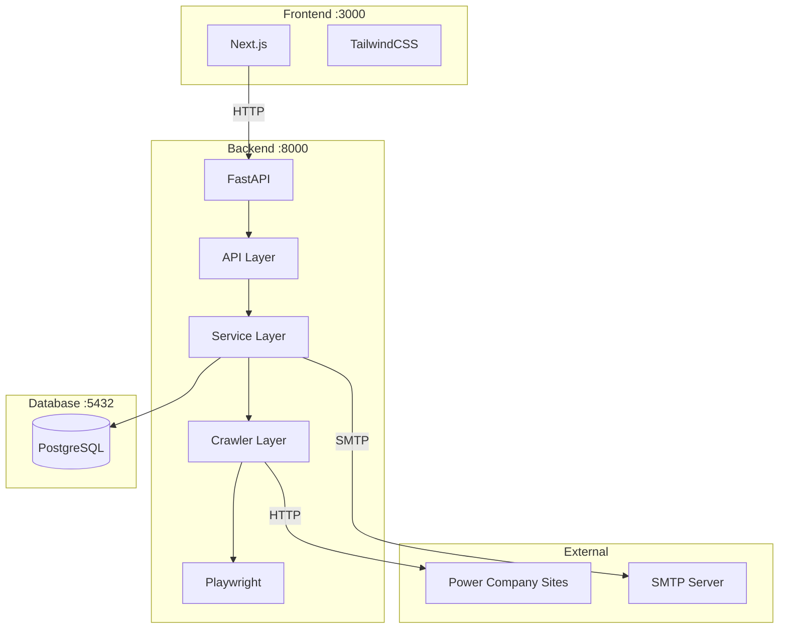

# 📋 Japan Power Price Crawler (JPPC) - 구현 계획서

> PRD.md 요구사항 정의서를 기반으로 한 상세 구현 계획

---

## 🎯 프로젝트 개요

일본 주요 4개 전력회사(도쿄전력, 츄부전력, 칸사이전력, 츄고쿠전력)의 전기 요금 정보를 자동 수집하는 시스템 구축

### 기술 스택 요약

- **Backend**: Python 3.12+ / FastAPI / Playwright / PostgreSQL
- **Frontend**: Next.js 14+ / TypeScript / TailwindCSS
- **Infra**: Docker / Docker Compose

---

## 📊 구현 단계별 계획

### Phase 1: 프로젝트 기초 설정 및 DB 설계 (Week 1)

#### 1.1 프로젝트 초기화

| 작업 ID | 작업 내용                                            | 산출물                | 우선순위 |
| ------- | ---------------------------------------------------- | --------------------- | -------- |
| P1-001  | 프로젝트 디렉토리 구조 생성                          | 디렉토리 구조         | 상       |
| P1-002  | Docker Compose 설정 (PostgreSQL, Backend, Frontend)  | docker-compose.yml    | 상       |
| P1-003  | Backend 환경 설정 (pyproject.toml, requirements.txt) | Python 프로젝트 설정  | 상       |
| P1-004  | Frontend 환경 설정 (package.json, tsconfig.json)     | Next.js 프로젝트 설정 | 상       |
| P1-005  | 환경변수 템플릿 작성 (.env.example)                  | 환경변수 문서         | 중       |

#### 1.2 데이터베이스 설계 및 구현

| 작업 ID | 작업 내용                 | 산출물         | 우선순위 |
| ------- | ------------------------- | -------------- | -------- |
| P1-006  | 데이터베이스 스키마 설계  | ERD 다이어그램 | 상       |
| P1-007  | SQLAlchemy 모델 구현      | models/\*.py   | 상       |
| P1-008  | Alembic 마이그레이션 설정 | alembic 설정   | 상       |
| P1-009  | 초기 마이그레이션 생성    | migration 파일 | 상       |

#### 1.3 기본 API 구조 구축

| 작업 ID | 작업 내용                      | 산출물          | 우선순위 |
| ------- | ------------------------------ | --------------- | -------- |
| P1-010  | FastAPI 앱 기본 구조 (main.py) | 앱 엔트리포인트 | 상       |
| P1-011  | 설정 관리 모듈 (config.py)     | 설정 클래스     | 상       |
| P1-012  | 로깅 유틸리티 구현             | logger.py       | 중       |
| P1-013  | 의존성 주입 설정 (deps.py)     | DI 설정         | 중       |
| P1-014  | 헬스체크 엔드포인트 (/health)  | API 엔드포인트  | 중       |

---

### Phase 2: 크롤러 개발 (Week 2)

#### 2.1 크롤러 기반 구조

| 작업 ID | 작업 내용                                   | 산출물              | 우선순위 |
| ------- | ------------------------------------------- | ------------------- | -------- |
| P2-001  | BaseCrawler 추상 클래스 설계                | base_crawler.py     | 상       |
| P2-002  | 크롤러 유틸리티 (Rate Limiting, Retry 로직) | crawler_utils.py    | 상       |
| P2-003  | User-Agent 및 robots.txt 처리               | compliance_utils.py | 중       |

#### 2.2 전력회사별 크롤러 구현

| 작업 ID | 작업 내용                       | 산출물             | 우선순위 |
| ------- | ------------------------------- | ------------------ | -------- |
| P2-004  | 도쿄전력(TEPCO) 크롤러 구현     | tepco_crawler.py   | 상       |
| P2-005  | 츄부전력(Chubu) 크롤러 구현     | chubu_crawler.py   | 상       |
| P2-006  | 칸사이전력(KEPCO) 크롤러 구현   | kepco_crawler.py   | 상       |
| P2-007  | 츄고쿠전력(Chugoku) 크롤러 구현 | chugoku_crawler.py | 상       |

#### 2.3 크롤러 테스트

| 작업 ID | 작업 내용                        | 산출물            | 우선순위 |
| ------- | -------------------------------- | ----------------- | -------- |
| P2-008  | 단위 테스트 작성 (pytest)        | test\_\*.py       | 중       |
| P2-009  | 통합 테스트 (전체 크롤링 플로우) | integration tests | 중       |

---

### Phase 3: 스케줄러 및 알림 기능 (Week 3)

#### 3.1 크롤링 서비스 계층

| 작업 ID | 작업 내용                               | 산출물             | 우선순위 |
| ------- | --------------------------------------- | ------------------ | -------- |
| P3-001  | CrawlService 구현 (실행/중지/상태 관리) | crawl_service.py   | 상       |
| P3-002  | 데이터 검증 및 변경 감지 로직           | data_validation.py | 상       |
| P3-003  | 크롤링 이력 저장 로직                   | crawl_log_repo.py  | 상       |

#### 3.2 스케줄러 구현

| 작업 ID | 작업 내용                | 산출물               | 우선순위 |
| ------- | ------------------------ | -------------------- | -------- |
| P3-004  | APScheduler 설정 및 통합 | scheduler_service.py | 상       |
| P3-005  | 주 1회 스케줄 설정 기능  | schedule_config.py   | 상       |
| P3-006  | 스케줄 CRUD API          | crawling.py API      | 상       |

#### 3.3 이메일 알림 시스템

| 작업 ID | 작업 내용                      | 산출물           | 우선순위 |
| ------- | ------------------------------ | ---------------- | -------- |
| P3-007  | EmailService 구현 (aiosmtplib) | email_service.py | 상       |
| P3-008  | 알림 수신자 관리 API           | alerts.py API    | 상       |
| P3-009  | 크롤링 실패 알림 템플릿        | email templates  | 상       |
| P3-010  | 요금 변경 알림 템플릿          | email templates  | 중       |
| P3-011  | 주간 리포트 템플릿             | email templates  | 하       |

---

### Phase 4: Backend API 완성 및 Frontend 기초 (Week 4)

#### 4.1 API 완성

| 작업 ID | 작업 내용              | 산출물       | 우선순위 |
| ------- | ---------------------- | ------------ | -------- |
| P4-001  | 전력회사 CRUD API 완성 | companies.py | 상       |
| P4-002  | 요금 정보 조회 API     | prices.py    | 상       |
| P4-003  | 요금 비교 API          | prices.py    | 중       |
| P4-004  | 요금 이력 조회 API     | prices.py    | 중       |
| P4-005  | 대시보드 통계 API      | stats.py     | 중       |

#### 4.2 Frontend 프로젝트 설정

| 작업 ID | 작업 내용                   | 산출물                 | 우선순위 |
| ------- | --------------------------- | ---------------------- | -------- |
| P4-006  | shadcn/ui 초기화 및 설정    | UI 컴포넌트 라이브러리 | 상       |
| P4-007  | TailwindCSS 테마 설정       | tailwind.config.js     | 상       |
| P4-008  | API 클라이언트 설정 (Axios) | api.ts                 | 상       |
| P4-009  | 타입 정의 파일 작성         | types/index.ts         | 상       |

#### 4.3 레이아웃 및 공통 컴포넌트

| 작업 ID | 작업 내용                               | 산출물            | 우선순위 |
| ------- | --------------------------------------- | ----------------- | -------- |
| P4-010  | 메인 레이아웃 (Header, Sidebar, Footer) | layout components | 상       |
| P4-011  | 네비게이션 메뉴 구현                    | Sidebar.tsx       | 상       |
| P4-012  | 로딩 및 에러 상태 컴포넌트              | ui components     | 중       |

#### 4.4 대시보드 화면

| 작업 ID | 작업 내용             | 산출물           | 우선순위 |
| ------- | --------------------- | ---------------- | -------- |
| P4-013  | 대시보드 페이지 구현  | page.tsx         | 상       |
| P4-014  | 최근 크롤링 상태 위젯 | dashboard widget | 상       |
| P4-015  | 요금 변동 알림 위젯   | dashboard widget | 중       |
| P4-016  | 전력회사 현황 위젯    | dashboard widget | 중       |

---

### Phase 5: Frontend 주요 화면 개발 (Week 5)

#### 5.1 전력회사 관리 화면

| 작업 ID | 작업 내용               | 산출물                  | 우선순위 |
| ------- | ----------------------- | ----------------------- | -------- |
| P5-001  | 전력회사 목록 화면      | companies/page.tsx      | 상       |
| P5-002  | 전력회사 등록/수정 모달 | form components         | 상       |
| P5-003  | 전력회사 상세 화면      | companies/[id]/page.tsx | 상       |

#### 5.2 요금 정보 화면

| 작업 ID | 작업 내용             | 산출물                  | 우선순위 |
| ------- | --------------------- | ----------------------- | -------- |
| P5-004  | 요금 목록 화면        | prices/page.tsx         | 상       |
| P5-005  | 요금 상세 보기 모달   | modal component         | 상       |
| P5-006  | 요금 비교 화면        | prices/compare/page.tsx | 중       |
| P5-007  | 요금 비교 테이블/차트 | compare components      | 중       |

#### 5.3 요금 이력 및 크롤링 관리

| 작업 ID | 작업 내용               | 산출물                  | 우선순위 |
| ------- | ----------------------- | ----------------------- | -------- |
| P5-008  | 요금 이력 화면 (차트)   | prices/history/page.tsx | 중       |
| P5-009  | Recharts 기반 추이 차트 | chart components        | 중       |
| P5-010  | 크롤링 관리 화면        | crawling/page.tsx       | 상       |
| P5-011  | 수동 크롤링 실행 UI     | crawl trigger UI        | 상       |
| P5-012  | 스케줄 설정 UI          | schedule config UI      | 상       |
| P5-013  | 크롤링 이력 조회        | crawl log viewer        | 중       |

#### 5.4 설정 화면

| 작업 ID | 작업 내용          | 산출물            | 우선순위 |
| ------- | ------------------ | ----------------- | -------- |
| P5-014  | 알림 설정 화면     | settings/page.tsx | 중       |
| P5-015  | 이메일 수신자 관리 | alert settings    | 중       |
| P5-016  | 시스템 설정 화면   | system settings   | 하       |

---

### Phase 6: 통합 테스트 및 최적화 (Week 6)

#### 6.1 통합 테스트

| 작업 ID | 작업 내용                    | 산출물            | 우선순위 |
| ------- | ---------------------------- | ----------------- | -------- |
| P6-001  | E2E 테스트 시나리오 작성     | test scenarios    | 상       |
| P6-002  | Frontend-Backend 통합 테스트 | integration tests | 상       |
| P6-003  | 크롤링 전체 플로우 테스트    | E2E crawl test    | 상       |

#### 6.2 Docker 최적화

| 작업 ID | 작업 내용                    | 산출물                  | 우선순위 |
| ------- | ---------------------------- | ----------------------- | -------- |
| P6-004  | Backend Dockerfile 최적화    | Dockerfile              | 중       |
| P6-005  | Frontend Dockerfile 최적화   | Dockerfile              | 중       |
| P6-006  | Docker Compose 프로덕션 설정 | docker-compose.prod.yml | 중       |
| P6-007  | 데이터 볼륨 설정 및 백업     | volume config           | 중       |

#### 6.3 문서화

| 작업 ID | 작업 내용                         | 산출물             | 우선순위 |
| ------- | --------------------------------- | ------------------ | -------- |
| P6-008  | API 명세서 작성 (OpenAPI/Swagger) | api-spec.md        | 중       |
| P6-009  | 데이터베이스 스키마 문서          | database-schema.md | 중       |
| P6-010  | 배포 가이드 작성                  | deployment.md      | 중       |
| P6-011  | README.md 작성                    | README.md          | 상       |

---

## 🏗️ 시스템 아키텍처



---

## 📁 프로젝트 구조

```
japan-power-price-crawler/
├── docker-compose.yml
├── .env.example
├── README.md
│
├── backend/
│   ├── Dockerfile
│   ├── pyproject.toml
│   ├── requirements.txt
│   │
│   ├── app/
│   │   ├── __init__.py
│   │   ├── main.py
│   │   ├── config.py
│   │   │
│   │   ├── api/
│   │   │   ├── __init__.py
│   │   │   ├── deps.py
│   │   │   └── v1/
│   │   │       ├── __init__.py
│   │   │       ├── companies.py
│   │   │       ├── prices.py
│   │   │       ├── crawling.py
│   │   │       └── alerts.py
│   │   │
│   │   ├── models/
│   │   │   ├── __init__.py
│   │   │   ├── company.py
│   │   │   ├── price_plan.py
│   │   │   ├── crawl_log.py
│   │   │   └── alert_setting.py
│   │   │
│   │   ├── schemas/
│   │   │   ├── __init__.py
│   │   │   ├── company.py
│   │   │   ├── price.py
│   │   │   ├── crawling.py
│   │   │   └── alert.py
│   │   │
│   │   ├── services/
│   │   │   ├── __init__.py
│   │   │   ├── price_service.py
│   │   │   ├── crawl_service.py
│   │   │   ├── email_service.py
│   │   │   └── scheduler_service.py
│   │   │
│   │   ├── crawlers/
│   │   │   ├── __init__.py
│   │   │   ├── base_crawler.py
│   │   │   ├── tepco_crawler.py
│   │   │   ├── chubu_crawler.py
│   │   │   ├── kepco_crawler.py
│   │   │   └── chugoku_crawler.py
│   │   │
│   │   ├── db/
│   │   │   ├── __init__.py
│   │   │   ├── database.py
│   │   │   └── repositories/
│   │   │       ├── __init__.py
│   │   │       ├── company_repo.py
│   │   │       ├── price_repo.py
│   │   │       └── crawl_log_repo.py
│   │   │
│   │   └── utils/
│   │       ├── __init__.py
│   │       ├── logger.py
│   │       └── helpers.py
│   │
│   ├── alembic/
│   │   ├── alembic.ini
│   │   └── versions/
│   │
│   └── tests/
│       ├── __init__.py
│       ├── conftest.py
│       ├── test_api/
│       └── test_crawlers/
│
├── frontend/
│   ├── Dockerfile
│   ├── package.json
│   ├── next.config.js
│   ├── tailwind.config.js
│   ├── tsconfig.json
│   │
│   ├── src/
│   │   ├── app/
│   │   │   ├── layout.tsx
│   │   │   ├── page.tsx
│   │   │   ├── companies/
│   │   │   │   ├── page.tsx
│   │   │   │   └── [id]/
│   │   │   │       └── page.tsx
│   │   │   ├── prices/
│   │   │   │   ├── page.tsx
│   │   │   │   ├── compare/
│   │   │   │   │   └── page.tsx
│   │   │   │   └── history/
│   │   │   │       └── page.tsx
│   │   │   ├── crawling/
│   │   │   │   └── page.tsx
│   │   │   └── settings/
│   │   │       └── page.tsx
│   │   │
│   │   ├── components/
│   │   │   ├── ui/
│   │   │   ├── layout/
│   │   │   │   ├── Header.tsx
│   │   │   │   ├── Sidebar.tsx
│   │   │   │   └── Footer.tsx
│   │   │   ├── dashboard/
│   │   │   ├── companies/
│   │   │   ├── prices/
│   │   │   └── crawling/
│   │   │
│   │   ├── lib/
│   │   │   ├── api.ts
│   │   │   └── utils.ts
│   │   │
│   │   ├── hooks/
│   │   │   ├── useCompanies.ts
│   │   │   ├── usePrices.ts
│   │   │   └── useCrawling.ts
│   │   │
│   │   └── types/
│   │       └── index.ts
│   │
│   └── public/
│
└── docs/
    ├── PRD.md
    ├── PLAN.md
    ├── api-spec.md
    └── database-schema.md
```

---

## 🎯 기능별 구현 체크리스트

### 크롤링 기능 (FR-001 ~ FR-006)

- [ ] FR-001: 전력회사 CRUD
- [ ] FR-002: 4개 전력회사 요금 정보 크롤링
- [ ] FR-003: 주 1회 자동 크롤링 (스케줄 설정)
- [ ] FR-004: 수동 크롤링 실행
- [ ] FR-005: 크롤링 상태 모니터링
- [ ] FR-006: 크롤링 이력 관리

### 데이터 관리 기능 (FR-007 ~ FR-011)

- [ ] FR-007: 요금 데이터 정규화 저장
- [ ] FR-008: 요금 변동 이력 추적
- [ ] FR-009: 데이터 유효성 검증
- [ ] FR-010: 변경 사항 감지
- [ ] FR-011: CSV/Excel 낳내기

### 알림 기능 (FR-012 ~ FR-015)

- [ ] FR-012: 이메일 알림 설정
- [ ] FR-013: 크롤링 실패 알림
- [ ] FR-014: 요금 변경 알림
- [ ] FR-015: 주간 리포트

### API 기능 (FR-016 ~ FR-021)

- [ ] FR-016: 전력회사 API
- [ ] FR-017: 요금 조회 API
- [ ] FR-018: 요금 비교 API
- [ ] FR-019: 이력 조회 API
- [ ] FR-020: 크롤링 작업 API
- [ ] FR-021: 대시보드 통계 API

### Frontend 화면 (FR-022 ~ FR-029)

- [ ] FR-022: 대시보드
- [ ] FR-023: 전력회사 관리 화면
- [ ] FR-024: 요금 정보 화면
- [ ] FR-025: 요금 비교 화면
- [ ] FR-026: 요금 이력 화면
- [ ] FR-027: 크롤링 관리 화면
- [ ] FR-028: 알림 설정 화면
- [ ] FR-029: 시스템 설정 화면

---

## ⚠️ 리스크 및 대응 방안

| 리스크                    | 영향도 | 대응 방안                             | 관련 작업       |
| ------------------------- | ------ | ------------------------------------- | --------------- |
| 전력회사 사이트 구조 변경 | 높음   | 크롤러별 모듈화로 개별 수정 용이      | P2-001 ~ P2-007 |
| 크롤링 차단               | 중간   | Rate limiting 준수, 적절한 User-Agent | P2-002, P2-003  |
| 일본어 인코딩 이슈        | 중간   | UTF-8 통일, 레거시 인코딩 변환        | P2-001          |
| 요금 체계 복잡성          | 중간   | 유연한 데이터 모델, JSON 필드 활용    | P1-006, P1-007  |

---

## 📈 성능 목표

| ID      | 요구사항           | 목표치     | 검증 방법         |
| ------- | ------------------ | ---------- | ----------------- |
| NFR-001 | 단일 사이트 크롤링 | 60초 이내  | 크롤링 로그 분석  |
| NFR-002 | 전체 크롤링 (4개)  | 5분 이내   | 크롤링 로그 분석  |
| NFR-003 | API 응답 시간      | 300ms 이내 | 로그/APM 모니터링 |
| NFR-004 | Frontend 초기 로딩 | 3초 이내   | Lighthouse 측정   |

---

## 🚀 다음 단계

1. **Phase 1 시작**: 프로젝트 디렉토리 구조 생성 및 Docker 설정
2. **개발 환경 구축**: 로컬 개발 환경에서 Docker Compose 실행
3. **DB 스키마 확정**: ERD 작성 및 모델 구현 시작

---

_문서 버전: 1.0_  
_작성일: 2026-01-31_  
_기준 문서: docs/PRD.md_
