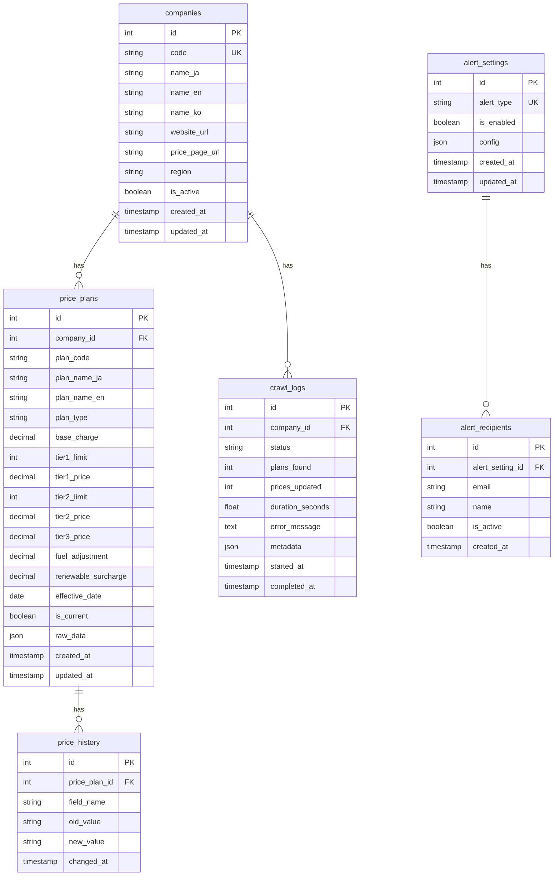

# 📊 데이터베이스 스키마 - Japan Power Price Crawler (JPPC)

> Database: PostgreSQL 16
> ORM: SQLAlchemy 2.0 (Async)
> Migration: Alembic

---

## 📋 목차

1. [ERD 다이어그램](#erd-다이어그램)
2. [테이블 정의](#테이블-정의)
3. [인덱스 정의](#인덱스-정의)
4. [제약 조건](#제약-조건)
5. [데이터 타입 설명](#데이터-타입-설명)

---

## ERD 다이어그램



---

## 테이블 정의

### 1. companies (전력회사)

일본 전력회사 정보를 저장합니다.

| 컬럼명 | 타입 | Null | 기본값 | 설명 |
|--------|------|------|--------|------|
| id | SERIAL | NO | auto | Primary Key |
| code | VARCHAR(50) | NO | - | 회사 코드 (tepco, chubu 등) |
| name_ja | VARCHAR(100) | NO | - | 일본어 회사명 |
| name_en | VARCHAR(100) | YES | - | 영어 회사명 |
| name_ko | VARCHAR(100) | YES | - | 한국어 회사명 |
| website_url | VARCHAR(500) | YES | - | 회사 웹사이트 URL |
| price_page_url | VARCHAR(500) | YES | - | 요금 페이지 URL |
| region | VARCHAR(50) | YES | - | 서비스 지역 |
| is_active | BOOLEAN | NO | true | 활성화 상태 |
| created_at | TIMESTAMP | NO | now() | 생성 시간 |
| updated_at | TIMESTAMP | NO | now() | 수정 시간 |

**인덱스:**
- `ix_companies_code` (UNIQUE): code
- `ix_companies_is_active`: is_active

---

### 2. price_plans (요금제)

전력 요금제 정보를 저장합니다.

| 컬럼명 | 타입 | Null | 기본값 | 설명 |
|--------|------|------|--------|------|
| id | SERIAL | NO | auto | Primary Key |
| company_id | INTEGER | NO | - | 회사 FK |
| plan_code | VARCHAR(100) | NO | - | 요금제 코드 |
| plan_name_ja | VARCHAR(200) | NO | - | 일본어 요금제명 |
| plan_name_en | VARCHAR(200) | YES | - | 영어 요금제명 |
| plan_type | VARCHAR(50) | NO | - | 요금제 타입 |
| base_charge | DECIMAL(10,2) | YES | - | 기본 요금 (엔) |
| unit_price | DECIMAL(10,4) | YES | - | 단일 단가 (엔/kWh) |
| tier1_limit | INTEGER | YES | - | 1단계 상한 (kWh) |
| tier1_price | DECIMAL(10,4) | YES | - | 1단계 단가 |
| tier2_limit | INTEGER | YES | - | 2단계 상한 (kWh) |
| tier2_price | DECIMAL(10,4) | YES | - | 2단계 단가 |
| tier3_price | DECIMAL(10,4) | YES | - | 3단계 단가 |
| fuel_adjustment | DECIMAL(10,4) | YES | - | 연료비 조정액 |
| renewable_surcharge | DECIMAL(10,4) | YES | - | 재생에너지 부과금 |
| effective_date | DATE | YES | - | 적용 시작일 |
| is_current | BOOLEAN | NO | true | 현재 적용 여부 |
| raw_data | JSONB | YES | - | 원본 크롤링 데이터 |
| created_at | TIMESTAMP | NO | now() | 생성 시간 |
| updated_at | TIMESTAMP | NO | now() | 수정 시간 |

**인덱스:**
- `ix_price_plans_company_id`: company_id
- `ix_price_plans_plan_code`: plan_code
- `ix_price_plans_is_current`: is_current
- `ix_price_plans_effective_date`: effective_date

**제약 조건:**
- `fk_price_plans_company`: company_id REFERENCES companies(id)
- `uq_price_plans_company_plan`: UNIQUE(company_id, plan_code, effective_date)

---

### 3. price_history (요금 이력)

요금 변경 이력을 추적합니다.

| 컬럼명 | 타입 | Null | 기본값 | 설명 |
|--------|------|------|--------|------|
| id | SERIAL | NO | auto | Primary Key |
| price_plan_id | INTEGER | NO | - | 요금제 FK |
| field_name | VARCHAR(100) | NO | - | 변경된 필드명 |
| old_value | VARCHAR(500) | YES | - | 이전 값 |
| new_value | VARCHAR(500) | YES | - | 새 값 |
| changed_at | TIMESTAMP | NO | now() | 변경 시간 |

**인덱스:**
- `ix_price_history_price_plan_id`: price_plan_id
- `ix_price_history_changed_at`: changed_at

---

### 4. crawl_logs (크롤링 로그)

크롤링 실행 기록을 저장합니다.

| 컬럼명 | 타입 | Null | 기본값 | 설명 |
|--------|------|------|--------|------|
| id | SERIAL | NO | auto | Primary Key |
| company_id | INTEGER | YES | - | 회사 FK (NULL=전체) |
| status | VARCHAR(20) | NO | - | 상태 (running/success/failed) |
| plans_found | INTEGER | YES | 0 | 발견된 요금제 수 |
| prices_updated | INTEGER | YES | 0 | 업데이트된 요금 수 |
| duration_seconds | FLOAT | YES | - | 소요 시간 (초) |
| error_message | TEXT | YES | - | 에러 메시지 |
| metadata | JSONB | YES | - | 추가 메타데이터 |
| started_at | TIMESTAMP | NO | - | 시작 시간 |
| completed_at | TIMESTAMP | YES | - | 완료 시간 |

**인덱스:**
- `ix_crawl_logs_company_id`: company_id
- `ix_crawl_logs_status`: status
- `ix_crawl_logs_started_at`: started_at

---

### 5. alert_settings (알림 설정)

알림 유형별 설정을 저장합니다.

| 컬럼명 | 타입 | Null | 기본값 | 설명 |
|--------|------|------|--------|------|
| id | SERIAL | NO | auto | Primary Key |
| alert_type | VARCHAR(50) | NO | - | 알림 유형 |
| is_enabled | BOOLEAN | NO | true | 활성화 상태 |
| config | JSONB | YES | - | 추가 설정 |
| created_at | TIMESTAMP | NO | now() | 생성 시간 |
| updated_at | TIMESTAMP | NO | now() | 수정 시간 |

**알림 유형:**
- `crawl_failure`: 크롤링 실패 알림
- `price_change`: 요금 변경 알림
- `weekly_report`: 주간 리포트

**인덱스:**
- `ix_alert_settings_alert_type` (UNIQUE): alert_type

---

### 6. alert_recipients (알림 수신자)

알림별 수신자 이메일을 저장합니다.

| 컬럼명 | 타입 | Null | 기본값 | 설명 |
|--------|------|------|--------|------|
| id | SERIAL | NO | auto | Primary Key |
| alert_setting_id | INTEGER | NO | - | 알림 설정 FK |
| email | VARCHAR(255) | NO | - | 이메일 주소 |
| name | VARCHAR(100) | YES | - | 수신자 이름 |
| is_active | BOOLEAN | NO | true | 활성화 상태 |
| created_at | TIMESTAMP | NO | now() | 생성 시간 |

**인덱스:**
- `ix_alert_recipients_alert_setting_id`: alert_setting_id
- `uq_alert_recipients_setting_email`: UNIQUE(alert_setting_id, email)

---

## 데이터 타입 설명

### Plan Type (요금제 타입)

| 값 | 설명 |
|-----|------|
| residential | 가정용 (従量電灯) |
| commercial | 상업용 |
| industrial | 산업용 |
| time_of_use | 시간대별 요금제 |

### Crawl Status (크롤링 상태)

| 값 | 설명 |
|-----|------|
| running | 실행 중 |
| success | 성공 |
| failed | 실패 |
| cancelled | 취소됨 |

---

## 데이터 보존 정책

| 테이블 | 보존 기간 | 비고 |
|--------|-----------|------|
| companies | 영구 | - |
| price_plans | 영구 | is_current로 현재/과거 구분 |
| price_history | 영구 | 변경 이력 추적용 |
| crawl_logs | 90일 | 자동 정리 대상 |
| alert_settings | 영구 | - |
| alert_recipients | 영구 | - |

---

## 마이그레이션 명령어

```bash
# 마이그레이션 생성
alembic revision --autogenerate -m "description"

# 마이그레이션 적용
alembic upgrade head

# 마이그레이션 롤백
alembic downgrade -1

# 현재 버전 확인
alembic current
```

---

_문서 버전: 1.0_
_최종 수정: 2026-01-31_
